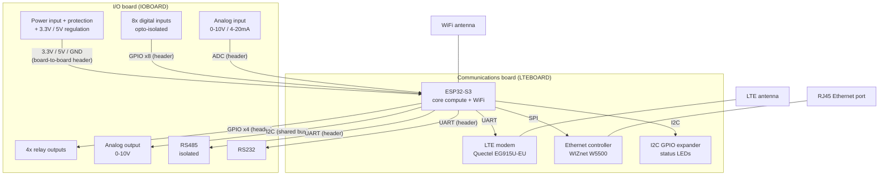

# Architecture

## Status

One-page block diagram drafted below (bus *kind*, not exact pin). Fine-grained pin
assignment is now done — see "Core-compute pin assignment" below for the exact GPIO
table, verified 2026-09-23 against the live schematic. One open item remains: adding
`platformio.ini`'s N16R8 flash/PSRAM override. The digital-input pin assignment (5 of 8
signals on GPIO3/39/42/46/47) was reviewed 2026-09-23 against Espressif's official
ESP32-S3 datasheet — accepted as-is, safe for this use; see "Fixed MCU constraints" and
the pin table below for the per-pin reasoning.

## Block diagram

## Bus assignment (by kind, not exact pin yet)

| Subsystem | Bus/interface | Notes |
|---|---|---|
| LTE modem | UART | AT commands |
| RS485 | UART | Isolated module handles the transceiver side |
| RS232 | UART | TI MAX3232EIPWR |
| Ethernet (W5500) | SPI | + 1 interrupt/CS line |
| I2C GPIO expander | I2C | Shared bus, status LEDs only |
| WiFi | Native (no external pins) | Antenna only |
| Digital inputs (8x) | GPIO, input | After opto-isolation |
| Relay outputs (4x) | GPIO, output | Driver stage TBD — see relay-outputs subsystem |
| Analog input (0-10V / 4-20mA) | ADC | After LDO + op-amp signal conditioning |
| Analog output (0-10V) | I2C (MCP4725 DAC) | ESP32-S3 has no built-in DAC peripheral (removed vs. ESP32/S2) — decided against PWM+filter in favor of an external I2C DAC chip (MCP4725), riding the same shared I2C bus as the ADC/expander rather than a dedicated GPIO line |

This uses all 3 hardware UARTs (LTE, RS485, RS232) — debug/console uses native USB instead
of a 4th UART.

## Board-to-board header — DECIDED 2026-09-22, FINAL 2026-09-22

Four generic connector symbols on the root sheet (`ioboard+lteboard.kicad_sch`) — two
physical parts per header (one on each board), same pin-numbering and net names on both
halves so they mate correctly. Footprints assigned at PCB layout (step 8/9): Samtec TSW
(male, THT) on the IOBOARD-side symbols, Samtec SSW (female, stacking socket) on the
LTEBOARD-side symbols, 2.54mm pitch throughout.

| Symbol | KiCad symbol | Gender | Board |
|---|---|---|---|
| J_PWR_IO | `Connector_Generic:Conn_02x05_Odd_Even` | Male (TSW) | IOBOARD |
| J_PWR_LTE | `Connector_Generic:Conn_02x05_Odd_Even` | Female (SSW) | LTEBOARD |
| J_SIG_IO | `Connector_Generic:Conn_02x12_Odd_Even` | Male (TSW) | IOBOARD |
| J_SIG_LTE | `Connector_Generic:Conn_02x12_Odd_Even` | Female (SSW) | LTEBOARD |

Pin map applies identically to both halves of each header (IO and LTE symbol get the
same net on the same pin number):

**J_PWR — 2x5, 10 pins:**

| Pin | Net |
|---|---|
| 1 | 3V3_LOGIC |
| 2 | VBAT_LTE |
| 3 | VBAT_LTE |
| 4 | GND_LOGIC |
| 5 | GND_LOGIC |
| 6 | GND_LOGIC |
| 7 | EARTH |
| 8 | spare |
| 9 | spare |
| 10 | spare |

Net names corrected 2026-09-22: the project's actual ground net is `GND_LOGIC`, not
plain `GND` (verified against every subsystem sheet). `EARTH` exists today as a
`global_label` in `core-compute`/`ethernet`/`lte` (LTEBOARD-side) but only a local
`label` in `rs485` (IOBOARD-side) — inconsistent; `rs485.kicad_sch`'s `EARTH` label
should be promoted to `global_label` for consistency, and is carried on this connector
regardless so board-to-board earth continuity actually exists physically.

**Caution:** `GND_LOGIC` and `EARTH` are KiCad `global_label`s, which connect by name
across the *entire* project regardless of physical board — ERC will show them as
connected even if pins 4-7 are never actually wired to this connector. ERC cannot be
trusted to catch a missing ground/earth pin here; wire it manually and double check.

**J_SIG — 2x12, 24 pins:**

| Pin | Net | Notes |
|---|---|---|
| 1 | RELAY1_CTRL | LTEBOARD (core-compute) → IOBOARD (relay_outputs) |
| 2 | RELAY2_CTRL | |
| 3 | RELAY3_CTRL | |
| 4 | RELAY4_CTRL | |
| 5 | DI1_MCU | IOBOARD (digital_inputs) → LTEBOARD (core-compute) |
| 6 | DI2_MCU | |
| 7 | DI3_MCU | |
| 8 | DI4_MCU | |
| 9 | DI5_MCU | |
| 10 | DI6_MCU | |
| 11 | DI7_MCU | |
| 12 | DI8_MCU | |
| 13 | RS485_TXD | rs485 (IOBOARD) <-> core-compute (LTEBOARD) |
| 14 | RS485_RXD | |
| 15 | RS232_TXD | rs232 (IOBOARD) <-> core-compute (LTEBOARD) |
| 16 | RS232_RXD | |
| 17 | I2C_SCL | shared bus: analog_io (IOBOARD) <-> core-compute/status_indication (LTEBOARD) |
| 18 | I2C_SDA | |
| 19 | spare | reserved — future differential analog upgrade |
| 20 | spare | reserved — future differential analog upgrade |
| 21 | spare | reserved — future differential analog upgrade |
| 22 | spare | reserved — general |
| 23 | spare | reserved — general |
| 24 | spare | reserved — general |

18 signals used, 6 spare. `ETH_*` (SPI) and `LTE_PWRKEY`/`LTE_RESET`/`LTE_TXD`/`LTE_RXD`
do NOT cross — `ethernet`, `lte`, and `core-compute` are all LTEBOARD-side already.
`analog_io` only exposes I2C pins today (no ADC/PWM GPIO lines drawn), so analog I/O
already rides the shared I2C bus above.

## Core-compute pin assignment (exact GPIO, verified 2026-09-23)

All 28 cross-subsystem signals now have a real GPIO on `core-compute.kicad_sch`,
confirmed by direct coordinate-level trace against the live schematic (each
hierarchical label's position matched to its nearest ESP32-S3-WROOM-1U symbol pin, not
assumed from the pin-planning notes). Board-to-board signals (crossing IOBOARD <->
LTEBOARD via `J_SIG`) marked accordingly; same-board signals (LTE/Ethernet, both
LTEBOARD-side) wire directly to `core-compute` without crossing the header.

| Signal | GPIO | Crosses header? | Notes |
|---|---|---|---|
| `I2C_SDA` | GPIO8 | No | Shared bus: analog_io DAC/ADC + status_indication expander |
| `I2C_SCL` | GPIO9 | No | |
| `ETH_SCSN` | GPIO10 | No | W5500 SPI chip-select |
| `ETH_MOSI` | GPIO11 | No | W5500 SPI |
| `ETH_SCLK` | GPIO12 | No | W5500 SPI |
| `ETH_MISO` | GPIO13 | No | W5500 SPI |
| `ETH_INTN` | GPIO14 | No | W5500 interrupt |
| `LTE_TXD` | GPIO17 | No | MCU -> modem |
| `LTE_RXD` | GPIO18 | No | modem -> MCU |
| `RELAY1_CTRL` | GPIO7 | Yes | |
| `RELAY2_CTRL` | GPIO38 | Yes | |
| `RELAY3_CTRL` | GPIO43 (TXD0) | Yes | Shares the module's default UART0 TX pin — fine since UART0/console isn't used for anything else here, but worth remembering if debug UART is ever needed |
| `RELAY4_CTRL` | GPIO44 (RXD0) | Yes | Same caveat as RELAY3_CTRL, RXD0 side |
| `RS232_TXD` | GPIO5 | Yes | |
| `RS232_RXD` | GPIO6 | Yes | |
| `RS485_TXD` | GPIO1 | Yes | |
| `RS485_RXD` | GPIO2 | Yes | |
| `LTE_PWRKEY` | GPIO15 | No | |
| `LTE_RESET` | GPIO16 | No | |
| `DI1_MCU` | GPIO40 | Yes | |
| `DI2_MCU` | GPIO41 | Yes | |
| `DI3_MCU` | GPIO48 | Yes | |
| `DI4_MCU` | GPIO3 | Yes | Strapping pin (JTAG source select), but only strapped if an eFuse this project never burns is set — verified safe 2026-09-23, see "Fixed MCU constraints." Optional weak pull-up removes the caveat entirely if wanted. |
| `DI5_MCU` | GPIO39 | Yes | Not a strapping pin (verified 2026-09-23, corrects an earlier note) — default JTAG (MTCK), safe as plain GPIO |
| `DI6_MCU` | GPIO42 | Yes | Not a strapping pin (verified 2026-09-23) — default JTAG (MTMS), safe as plain GPIO |
| `DI7_MCU` | GPIO46 | Yes | Strapping pin (boot-mode, paired with GPIO0), irrelevant unless GPIO0 is also forced low — safe for normal operation, see "Fixed MCU constraints" |
| `DI8_MCU` | GPIO47 | Yes | Not a strapping pin (verified 2026-09-23) — safe as plain GPIO |

Free/unassigned: GPIO0 (strapping, not yet given an explicit No-Connect or strapping
resistor treatment — separate open item), GPIO21/35/36/37/45 (No-Connect flagged,
matches the documented exclusions below).

## Known gaps — deferred to next generation (flagged 2026-09-22)

Reviewed against a comparable commercial reference design. Not blocking this build, but
should not be forgotten:

- **No surge/ESD/transient protection on field terminals** (DI, relay outputs, RS485,
  power input) — industrial field wiring needs TVS diodes or equivalent on every
  externally-exposed pin. Not designed yet.
- **No reverse-polarity / overcurrent protection on the power input.**
- **No confirmed galvanic isolation between field-side and logic-side power domains**
  beyond the DI opto-couplers and relay contacts already in place (e.g. an isolated
  DC-DC for the field rail).
- **Analog I/O is single-ended (1-2 ADC lines + PWM/RC output), not differential /
  4-20mA current-loop** like the reference design's AIN+/AIN-, AOUT+/AOUT-. This was
  already an intended subsystem (see subsystem list) — the gap is the signal topology,
  not the existence of the subsystem. 3 spare pins reserved on J_SIG (above) to allow
  adding differential inputs later without a new connector.
- **`core-compute.kicad_sch`'s DI/RELAY pin assignments verified 2026-09-23** (direct
  coordinate-level check against the live schematic — see the pin table below). Not a
  gap; kept here as the record of when it was last confirmed.

None of these are needed for a first prototype/bring-up run; they matter before calling
this an "industrial" product.

## Fixed MCU constraints (ESP32-S3)

- GPIO26-32: reserved, in-package SPI flash — never reuse
- GPIO33-37: reserved, in-package octal PSRAM — never reuse
- **Strapping pins (verified 2026-09-23 against Espressif's official ESP32-S3 datasheet +
  WROOM-1/1U module datasheet — only these four, nothing else, is a strapping pin):**
  - GPIO0 — boot-mode select (SPI boot vs download boot). Avoid driving externally during
    reset unless deliberately entering download mode.
  - GPIO3 — JTAG signal source select. Datasheet: "does not have any internal pull
    resistors and the strapping value must be controlled by the external circuit that
    cannot be in a high impedance state" — but this value is only read at all if the
    `EFUSE_STRAP_JTAG_SEL` eFuse has been burned (not the factory default, and not
    something this project's flow does). Effectively safe as-is; a cheap weak external
    pull-up costs nothing and removes the caveat entirely regardless of eFuse state.
  - GPIO45 — VDD_SPI voltage select. Not used by any subsystem on this project.
  - GPIO46 — paired with GPIO0 for chip boot-mode selection (SPI boot vs download boot).
    Irrelevant to normal runtime boot whenever GPIO0 reads high, which is GPIO0's own
    power-on default — only matters if GPIO0 is *also* forced low at the same moment
    (e.g. an in-field reflash procedure that drives GPIO0), in which case GPIO46's level
    picks the download sub-mode. Not a risk for a signal that's only ever read as a DI
    input under normal operation.
- **GPIO39/40/41/42, 47, 48 are NOT strapping pins** (correction 2026-09-23 — an earlier
  note here called 39/42/47 "nonstandard reset behavior," not substantiated against the
  official datasheet on recheck; superseded). GPIO39-42 are the chip's *default* JTAG
  pins (MTCK/MTDO/MTDI/MTMS) but only active as JTAG if that signal source is selected
  (see GPIO3 above) — otherwise ordinary GPIOs, safe to reuse, at the cost of losing
  on-pin JTAG debug if it's ever needed. GPIO47/48's only alternate function is an
  optional differential SPI clock pair, active only if firmware explicitly selects it.
  GPIO21 has no documented special function either — the toolchain sanity-check sketch
  used it for a throwaway simulated LED, which is why it was flagged as "already spoken
  for" here, not because of any reset-time risk; free to reuse for a real subsystem
  signal like any other plain GPIO.
- Verified via two official Espressif sources (chip datasheet + WROOM-1/1U module
  datasheet); the full Technical Reference Manual wasn't reachable to cross-check in this
  pass — treat the GPIO46 "boot log" behavior specifically as unconfirmed if it ever
  becomes load-bearing.
- 3 hardware UART controllers available (LTE + RS485 + RS232 fits with debug/console on
  native USB)
