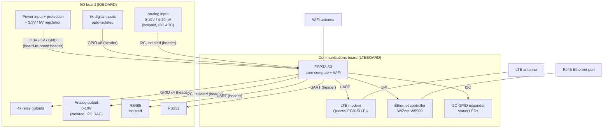

# Architecture

## Status

One-page block diagram drafted below. Fine-grained pin assignment is deferred to roadmap
step 6 — this diagram fixes which subsystem talks over which *kind* of bus, not the exact
GPIO number.

## Block diagram

## Bus assignment (by kind, not exact pin yet)

| Subsystem | Bus/interface | Notes |
|---|---|---|
| LTE modem | UART | AT commands |
| RS485 | UART | Isolated module handles the transceiver side |
| RS232 | UART | MAX3232EI |
| Ethernet (W5500) | SPI | + 1 interrupt/CS line |
| I2C GPIO expander | I2C | Shared bus, status LEDs only |
| WiFi | Native (no external pins) | Antenna only |
| Digital inputs (8x) | GPIO, input | After opto-isolation |
| Relay outputs (4x) | GPIO, output | Driver stage TBD — see relay-outputs subsystem |
| Analog input (0-10V / 4-20mA) | I2C (isolated) | External ADC + LDO + op-amp signal conditioning, isolated side — see analog-io.md |
| Analog output (0-10V) | I2C (isolated) | External DAC + op-amp gain stage, isolated side — ESP32-S3 has no built-in DAC peripheral (removed vs. ESP32/S2); see analog-io.md |

This uses all 3 hardware UARTs (LTE, RS485, RS232) — debug/console uses native USB instead
of a 4th UART.

## Board-to-board header

Rough signal count ahead of exact pin assignment at step 6: power (3.3V, 5V, GND) + 4 relay
GPIOs + 8 digital-input GPIOs + isolated I2C (SDA/SCL, shared by the analog ADC and DAC —
no separate ADC/PWM lines needed, see analog-io.md) + RS485 UART (TX/RX + possible DE/RE) +
RS232 UART (TX/RX) — roughly 18+ signal lines plus power/ground. Gets its own test milestone
at roadmap step 7. (Analog I/O originally planned as dedicated ADC + PWM lines; moved to the
isolated I2C bus during analog-io subsystem design — net fewer header signals, not more.)

## Subsystem list

- Power (input protection, regulation)
- Core compute (ESP32-S3 bring-up)
- WiFi
- LTE (cellular modem)
- Ethernet
- Digital inputs (8x, opto-isolated)
- Relay outputs (4x)
- Analog I/O (input + output)
- RS485 (isolated)
- RS232
- Status indication (I2C GPIO expander + LEDs)

## Fixed MCU constraints (ESP32-S3)

- GPIO26-32: reserved, in-package SPI flash — never reuse
- GPIO33-37: reserved, in-package octal PSRAM — never reuse
- GPIO0/45/46/3: strapping pins — boot-mode sensitive, use with care
- GPIO39/42/47/21: nonstandard reset behavior. The toolchain sanity-check sketch uses
  GPIO21 for its throwaway simulated LED — fine for that one-off test, do not reuse GPIO21
  for a real subsystem signal.
- 3 hardware UART controllers available (LTE + RS485 + RS232 fits with debug/console on
  native USB)
