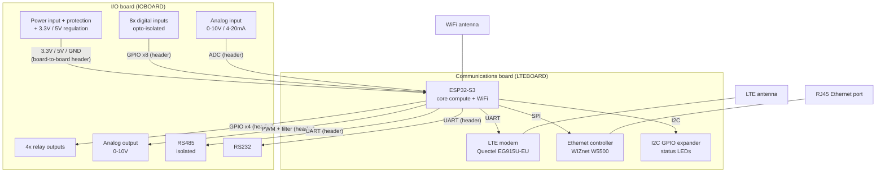

# Architecture

## Status
One-page block diagram drafted (below). Fine-grained pin assignment is still deferred to
roadmap step 6 (Phase B) — this diagram fixes which subsystem talks over which *kind* of
bus, not which exact GPIO number, per the two-tier resource-planning approach.

## Block diagram

## Bus assignment (by kind, not by exact pin yet)
| Subsystem | Bus/interface | Notes |
|---|---|---|
| LTE modem | UART | AT commands |
| RS485 | UART | isolated module handles the transceiver side |
| RS232 | UART | MAX3232EI |
| Ethernet (W5500) | SPI | + 1 interrupt/CS line |
| I2C GPIO expander | I2C | shared bus, status LEDs only |
| WiFi | native (no external pins) | antenna only |
| Digital inputs (8x) | GPIO, input | after opto-isolation |
| Relay outputs (4x) | GPIO, output | driver stage still TBD — see Protection checklist |
| Analog input (0-10V / 4-20mA) | ADC | after LDO + op-amp signal conditioning |
| Analog output (0-10V) | PWM + RC filter, **not a native DAC** | ESP32-S3 has no built-in DAC peripheral (removed vs. original ESP32/S2) — confirmed via Espressif community sources. Needs PWM+filter or a small external DAC chip; decide during step 6. |

This uses all 3 hardware UARTs (LTE + RS485 + RS232) — debug/console must use native USB,
confirmed workable per the fixed constraints below.

## Board-to-board header — rough signal count (finalize in step 6)
Everything on IOBOARD needs a path back to the ESP32-S3 on LTEBOARD, so the header carries
more than just power. Rough count, before exact pin assignment: power (3.3V, 5V, GND) +
4 relay GPIOs + 8 digital-input GPIOs + 1-2 ADC lines + 1 PWM line + RS485 UART (TX/RX +
possible DE/RE direction pin) + RS232 UART (TX/RX) ≈ 20+ signal lines plus power/ground.
This is why the board-to-board interconnect gets its own explicit test milestone in step 7 —
it's a real multi-pin interface, not a simple 4-wire connector.

## Subsystem list
- Power (input protection, regulation)
- Core compute (ESP32-S3 bring-up)
- WiFi
- LTE (cellular modem)
- Ethernet
- Digital inputs (8x, opto-isolated)
- Relay outputs (4x)
- Analog I/O (input + output)
- RS485 (isolated)
- RS232
- Status indication (I2C GPIO expander + LEDs)

## Fixed MCU constraints (ESP32-S3)
- GPIO26-32: reserved, in-package SPI flash — never reuse
- GPIO33-37: reserved, in-package octal PSRAM — never reuse
- GPIO0/45/46/3: strapping pins — boot-mode sensitive, use with care
- GPIO39/42/47/21: nonstandard reset behavior. (Note: the toolchain sanity-check sketch
  currently uses GPIO21 for its throwaway simulated LED — fine for that one-off test, but
  do not reuse GPIO21 for a real subsystem signal.)
- 3 hardware UART controllers available (LTE + RS485 + RS232 fits if debug/console
  uses native USB instead of a 4th UART)
